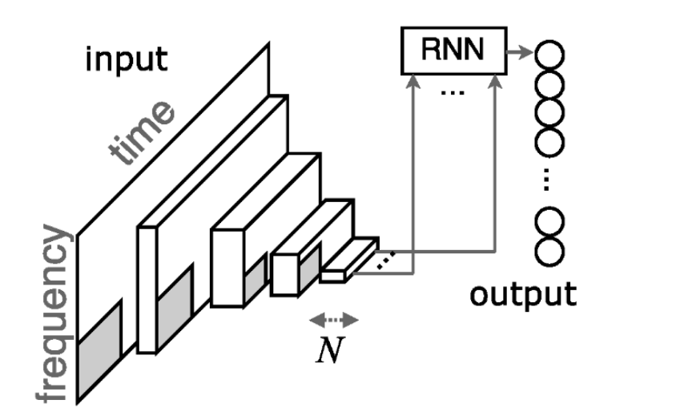

# Music Auto-tagging based on CRNN

## Description

This reposity is used for keras implementation of Music Auto-tagging based on CRNN.

The idea of CRNN for music classification comes from "[Convolutional recurrent neural networks for music classification](https://ieeexplore.ieee.org/document/7952585)"

In that paper, there are **4 conv layers** and **2 GRU layers** in its network architecture. The whole structures shown by below figure:



This code refers to [music-auto_tagging-keras
](https://github.com/keunwoochoi/music-auto_tagging-keras#keras-versions).

## Dataset

The dataset that we used in this reposity is `MagnaTagATune`.

Please visiting [the-magnatagatune-dataset](http://mirg.city.ac.uk/codeapps/the-magnatagatune-dataset) for downloading it. This code needs `Audio data` and `Tag annotations`.

Furthermore, more information about `MagnaTagATune` will be found in [music-auto_tagging-keras](https://github.com/keunwoochoi/magnatagatune-list).

## Directories and Files

```bash
.
├── checkpoints  # saving weight checkpoints
├── constants.py  # const parameters
├── data
│   ├── mp3  # audios with mp3 format
│   └── npys  # mel-spectrogram features
├── models.py  # crnn model created by keras
├── preprocess.py  # preprocess
├── README.md
├── run.py  # train & test
├── requirements.txt  # environment requirements
└── src  # README source
    └── img
```

## Usage

Python version: `3.6.8`

Install all requirements: `pip install -r requirements.txt`

Check and modify const parameters in `constants.py`

Run preprocess: `python preprocess.py`

Run train: `python run.py train`

Run test: `python run.py test`